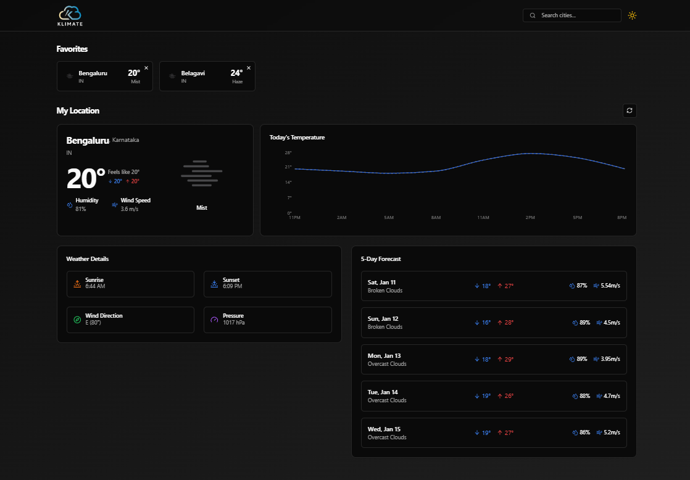
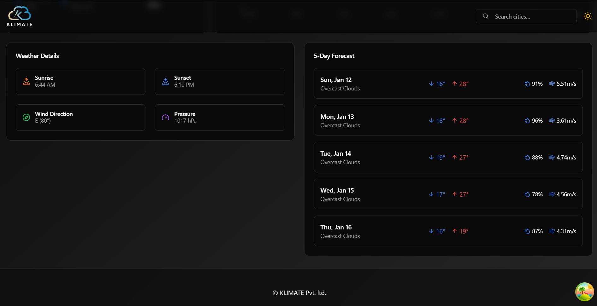
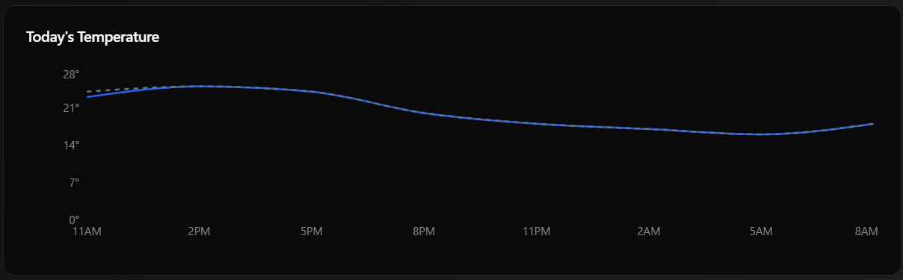
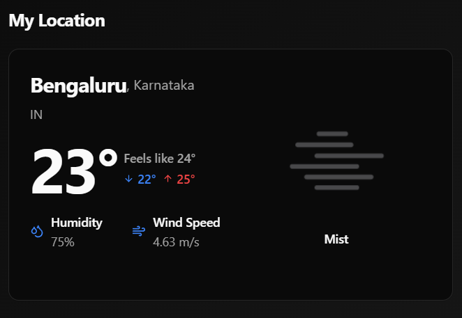

# Klicheck 🌦️

**Klicheck** is a responsive and user-friendly weather forecasting web application. It delivers real-time weather updates, a 5-day forecast, and personalized daily highlights. With its modern design and seamless functionality, Klicheck ensures that weather tracking is both efficient and visually engaging.

## [🔥Live Demo]()

---

## Features ✨

- **Real-Time Weather Updates**: Provides current temperature, wind speed, humidity, and more for any location.
- **5-Day Weather Forecast**: Displays weather trends with visually appealing charts.
- **Favorites Section**: Save and manage your favorite locations for quick access.
- **Responsive Design**: Optimized for all devices, from mobile phones to desktops.
- **Interactive Interface**: Built with a focus on usability and performance.

---

## Technologies Used 🛠️

- **Frontend**: React.js
- **Styling**: Tailwind CSS
- **Data Handling**: OpenWeather API
- **Version Control**: Git and GitHub

---

## Project Setup 🚀

Follow these steps to set up Klicheck locally:

1. **Clone the Repository**:

    ```bash
        git clone https://github.com/yourusername/klicheck.git
        cd klicheck
    ```

2. **Install Dependencies**:

    ```bash
        npm i
    ```

3. **Add OpenWeather API Key**:

    - Create a .env file in the root directory.

    - Add your API key as:

    ```env
        REACT_APP_OPENWEATHER_API_KEY=your_api_key_here
    ```

4. **Start the Application**:

    ```bash
        npm run dev
    ```

---

## Screenshots 🖼️

- **Real-Time Weather Dashboard**

    

- **5-Day Forecast**
  
    

- **Favorites Section**
  
    

- **Chart Section**

    

- **My Loaction Section**

    

---

## Contributing 🤝

Contributions are welcome! If you'd like to contribute:

- Fork the repository.

- Create a feature branch: git checkout -b feature-name.

- Commit your changes: git commit -m "Add feature-name".

- Push to the branch: git push origin feature-name.

- Create a pull request.
